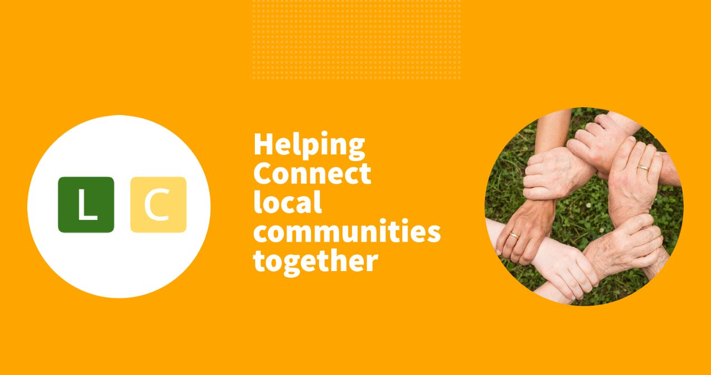

# loconnect
Final submission for [hack2021forpositivity](https://hack2021forpositivity-platform.bemyapp.com) organized by Google Cloud and MongoDB.

## Preface
Collaboration platform to help connect locals and resolve generic problems in the community.

   

## Abstract

[Presentation](https://docs.google.com/presentation/d/1EIsOqHJ6odab3YuqRKj0rvgLOebA6IZPzSsvsqrI78w/edit?usp=sharing)

## Challenge Category
### Label Selected : #4 *Wild Card*

   

### Problem statement
Do you have a solution that encompasses all the challenges above? Do you have an idea that is completely out of the box, but still addresses social responsibility, sustainability, mental wellbeing, and/or connects individuals with tools to promote general welfare? If so, the Wildcard challenge is for you! Use Google Cloud, MongoDB Atlas, and  your own technology with your developer skills to create a unique and useful solution!

   

## Description
### The Issue
We all are trying to resolve problems for the greater good but frankly are not addressing problems at a local scale. Most of the issues from various domains like pollution and community support are not being resolved due to lack of collaboration within local community. Even if we know the issue, we don't have the proper means to address those issues since we can't pinpoint issue(s) location.

   

## Solution
### Description
Regional support platform to help connect local communities and keep the fake news spread in check by allowing query to be listed from their nearby locations only. Users can list general welfare problems on the platform to be resolved by local volunteers. Built using serverless solutions from GCP and mongodb atlas. Proper location records are maintained to quickly locate problems. 

   

## How it Works (Deliverables)
### 1. **Get started ( Web | Android )**  
Please do make sure that location is turned **ON** for both **Chrome** and **Settings**.

    
        
    
    
        
    

   

| Platform      | Link                                                                                |
|---------------|-------------------------------------------------------------------------------------|
| Web           | [ removed ]                            | 
| Android (TWA) | [ removed ]  |

   

### 2. **List Nearby Locations**  
Login in the application using your Google Account. The app will list nearby issues added with option to mark them as irrelevant or undertake them individually (measure to ensure social distancing) 

### 3. **Report an Issue in your current locality region**  
Report any issue you observe nearby in report panel. Report will be sent to worflow and will be published after validation. Post with any sort of abusive/toxic language will be discarded automatically.

### 4. **Operating on undertaken issues**  
Panel will list undertaken locations by user with an option to mark as completed or option to reject issue in case of unavailability. Map also plots nearby public transit routes for reference. 

   

    
        
    
    
        
    
    
        
    

   

### 5. **Monitoring dashboard**
Below is the sample overview of the custom dashboard developed on data studio

   

### 6. **Architecture Overview**  
Below architecture layout interface defines the complete working of the application

   

   

   

